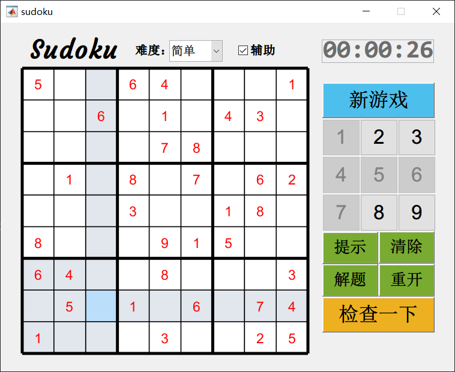
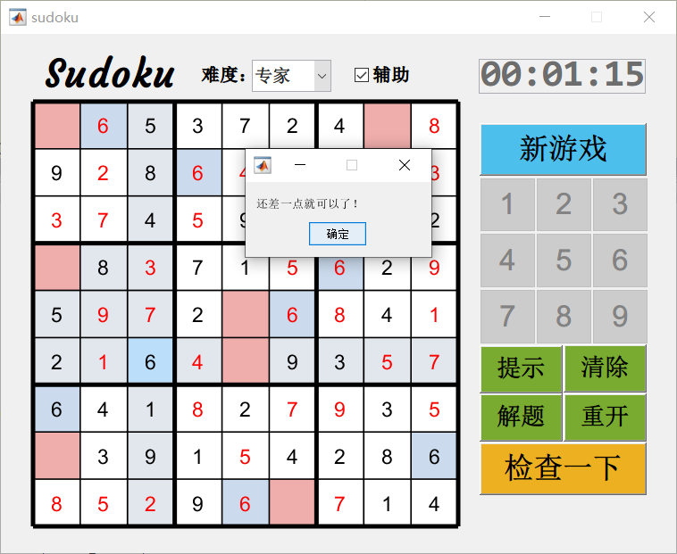

# Sudoku

一个用MATLAB写的数独小游戏

## 简介

数独盘面是个九宫，每一宫又分为九个小格。在这八十一格中给出一定的已知数字和解题条件，利用逻辑和推理，在其他的空格上填入1-9的数字。使1-9每个数字在每一行、每一列和每一宫中都只出现一次，所以又称“九宫格”。

## 使用方法

### GUI

```matlab
>> sudoku
```



  
### 命令行

- 生成数独

```matlab
>> difficulty = 2;
>> [solvedPuzzle, res] = generatePuzzle(difficulty)

solvedPuzzle =

     5    10    10     8     4    10    10    10     6
    10     1    10     2    10    10     9    10    10
    10     7    10    10    10     5    10    10    10
    10    10    10    10     1    10    10    10     7
    10    10    10     7    10    10    10     8    10
    10    10     9    10    10     8    10    10    10
     1    10    10     5    10    10    10     6    10
    10     9     2    10    10    10     3    10     5
    10    10     7    10    10     6    10     2    10

res =

     5     2     3     8     4     9     7     1     6
     4     1     6     2     7     3     9     5     8
     9     7     8     1     6     5     2     4     3
     2     8     5     3     1     4     6     9     7
     3     6     1     7     9     2     5     8     4
     7     4     9     6     5     8     1     3     2
     1     3     4     5     2     7     8     6     9
     6     9     2     4     8     1     3     7     5
     8     5     7     9     3     6     4     2     1
```

- 求解数独

```matlab
>> [board, state] = solveSudoku(solvedPuzzle)

board =

     5     2     3     8     4     9     7     1     6
     4     1     6     2     7     3     9     5     8
     9     7     8     1     6     5     2     4     3
     2     8     5     3     1     4     6     9     7
     3     6     1     7     9     2     5     8     4
     7     4     9     6     5     8     1     3     2
     1     3     4     5     2     7     8     6     9
     6     9     2     4     8     1     3     7     5
     8     5     7     9     3     6     4     2     1

state =

     2
```
